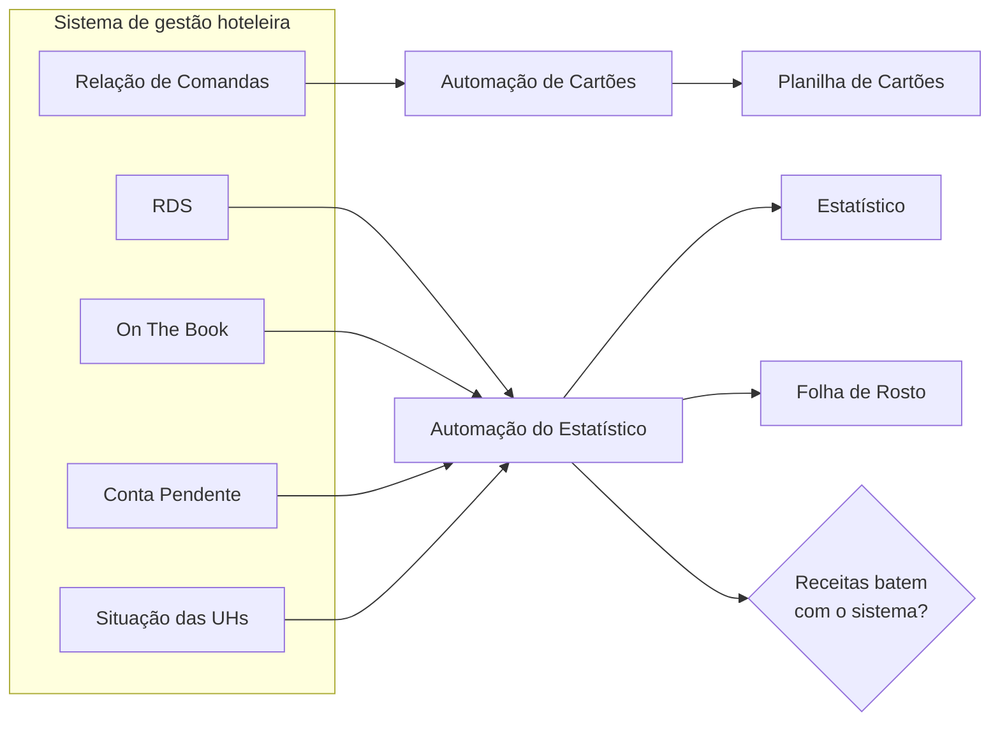

# Automação da Auditoria Noturna Hoteleira


Scripts em Python que automatizam duas rotinas diárias da auditoria noturna de um hotel: o **fechamento de cartões** e o **relatório estatístico**. Os relatórios exportados do sistema de gestão hoteleira entram, as planilhas saem prontas pra enviar.

🌎 *[Read in English](README.en.md)*

---

## Resultado

| Rotina | Antes | Depois |
|---|---|---|
| 💳 Planilha de cartões | 20–25 min | **< 2 min** |
| 📊 Estatístico + Folha de Rosto | 30–40 min | **< 2 min** |
| **Por noite** | **quase 1 hora** | **menos de 4 minutos** |

E com menos erro: o que antes dependia de revisar tudo no olho agora tem conferência automática.

## Contexto

Trabalho como auditor noturno num hotel em Brasília. Toda madrugada, parte do turno ia em copiar números de relatórios do sistema para planilhas Excel: somar valores por bandeira de cartão, separar maquininha de cobrança online, alternar entre quatro relatórios pra preencher o estatístico — e depois revisar tudo, porque um número no lugar errado estraga o fechamento.

É trabalho repetitivo, com regras bem definidas e muito espaço pra erro de digitação: o cenário ideal pra automatizar. Construí essas ferramentas pra usar no meu próprio turno, e a de cartões já é usada também por outra auditora da equipe.

## As duas automações

### 💳 Planilha de Controle de Cartões
Lê o relatório de comandas (`.xlsx` ou `.pdf`), identifica a bandeira de cada lançamento, separa **maquininha** de **cobrança online** e preenche a planilha. As fórmulas calculam o total de cada bandeira e a parte online; o auditor só digita o fechamento das maquininhas.

→ [Regras de negócio e detalhes técnicos](docs/cartoes.md)

### 📊 Estatístico e Folha de Rosto
Cruza quatro relatórios (RDS, On The Book, Conta Pendente e Situação das UHs) pra preencher o relatório estatístico e a folha de rosto que vai pra gerência — ocupação, diária média, RevPAR, receitas, previsão de 3 dias, contas pendentes, walk-ins, no-shows. No fim, confere se as receitas batem com o total do sistema.

→ [De onde vem cada número](docs/estatistico.md)

## Como funciona



## Teste você mesmo

O repositório vem com **relatórios e planilhas 100% fictícios** em [`exemplos/`](exemplos/), no mesmo formato que os scripts leem.

1. Baixe o projeto (botão verde **Code** → **Download ZIP**, ou `git clone` com o link desse botão)
2. Instale as dependências, dentro da pasta do projeto:

```bash
python -m pip install -r requirements.txt
```

3. Copie os arquivos de exemplo pra pasta de cada automação e rode — o passo a passo está em [`exemplos/README.md`](exemplos/README.md)

### Testes automatizados

```bash
python -m unittest discover -s tests -v
```

São 28 testes que verificam as regras (bandeiras, marcadores de cobrança online, leitura de cada relatório, cálculos da folha de rosto) usando os dados de exemplo. Se alguém mexer numa regra e quebrar outra, os testes avisam.

## Tecnologias

- **Python 3** — sem framework, só bibliotecas pequenas
- **openpyxl** — preenchimento das planilhas Excel existentes
- **xlrd** — leitura dos relatórios em `.xls` (formato antigo)
- **pypdf** — leitura do relatório de comandas em PDF
- **zipfile + xml.etree** — leitura "na unha" de um `.xlsx` que o openpyxl recusa
- **unittest** — testes automatizados
- **Windows `.bat`** — pra equipe rodar com dois cliques, sem abrir terminal

## Estrutura do projeto

```
hotel-night-audit-automation/
├── cartoes/
│   ├── preencher_cartoes.py        # automação de cartões
│   └── EXECUTAR.bat                # atalho de dois cliques
├── estatistico/
│   └── Preencher Estatistico.bat   # automação do estatístico (arquivo único)
├── exemplos/                       # dados fictícios + gerador
├── tests/                          # testes automatizados
├── docs/
│   ├── cartoes.md                  # regras de negócio dos cartões
│   └── estatistico.md              # mapeamento relatório → planilha
├── requirements.txt
└── LICENSE
```

## Desafios técnicos

- **Um `.xlsx` que o Excel abre, mas o Python não.** O sistema exporta o arquivo com um atributo escrito errado, e o openpyxl se recusa a ler. A solução foi abrir o `.xlsx` como o que ele é — um zip de XMLs — e ler os dados direto.
- **Dados sujos na origem.** Lançamentos sem descrição, erros de digitação recorrentes (`B2PAY` em vez de `BEE2PAY`) e nomes de operadora colados na bandeira (`"CIELO"` tem `"ELO"` dentro). Cada caso virou uma regra — e um teste.
- **Uma regra que não se sustentou.** A primeira versão identificava a maquininha pelo número do documento. Com o tempo o padrão mudou e a regra ficou pouco confiável; foi trocada por uma baseada só no que está escrito.
- **Achar os números pelo nome, não pela posição.** Os relatórios são lidos como uma grade e cada campo é encontrado pelo rótulo. Se uma linha mudar de lugar, o script continua funcionando.
- **Duas fontes, dois momentos.** O RDS é o fechamento do dia; a Situação das UHs é a foto de agora. Cada campo da folha de rosto usa a fonte certa pro que ele representa.
- **Filtrar o que não é do hotel.** O prédio divide espaço com unidades de condomínio que aparecem no mesmo relatório e precisam ficar fora das estatísticas.
- **Desconfiar do próprio resultado.** Conferência das receitas com o total do sistema, avisos quando algo não bate, backup antes de gravar e gravação em arquivo temporário pra nunca sobrar planilha pela metade.
- **Usuários não técnicos.** Tudo roda com dois cliques. O estatístico é um único arquivo que é, ao mesmo tempo, script do Windows e programa Python.

## Privacidade dos dados

Os relatórios reais têm nomes de hóspedes e dados financeiros, e as planilhas do hotel são dele. Por isso:

- **Nenhum dado real** está no repositório — o `.gitignore` bloqueia planilhas, PDFs e relatórios por padrão
- Os exemplos são **inventados**, e os modelos de planilha foram **desenhados do zero** pra demonstração
- O código não tem nome do hotel nem número de maquininha

## Próximos passos

- [ ] Arquivo de configuração separado do código (nomes de arquivo, linhas das planilhas, marcadores), pra adaptar a outro hotel sem mexer no Python
- [ ] Testes da leitura em PDF do relatório de comandas
- [ ] Uma regra confiável pra detectar lançamentos sem descrição e reativar o log de acompanhamento da equipe

## Autor

**Kevin Joshua Siqueira Marques** — em transição para análise de dados, estudante de Análise e Desenvolvimento de Sistemas.

[LinkedIn](https://br.linkedin.com/in/kevin-joshua-291b26249)
