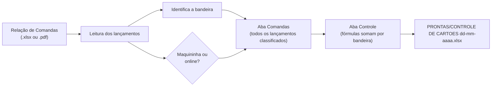
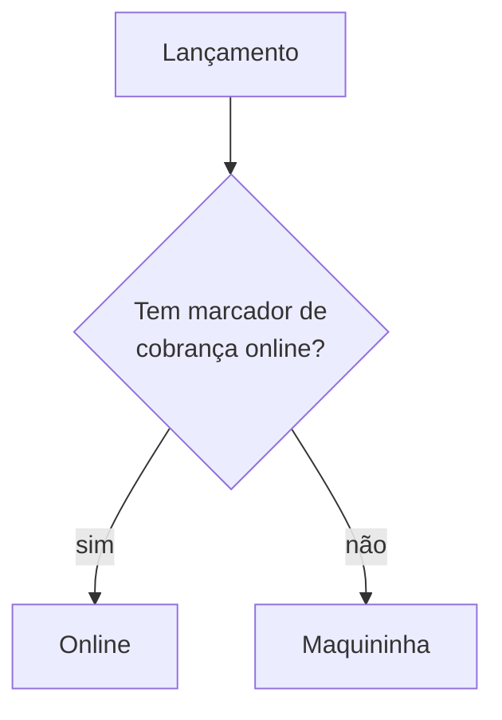

# Planilha de Controle de Cartões

> Automação do fechamento diário de cartões na auditoria noturna.
> Código: [`cartoes/preencher_cartoes.py`](../cartoes/preencher_cartoes.py)

## O problema

Toda noite, a auditoria confere se o que foi cobrado em cartão no sistema do hotel bate com o que passou nas maquininhas. No processo manual, era preciso abrir o relatório **Relação de Comandas** (Borderô de Débitos e Créditos), calcular o total geral, calcular o total de cada bandeira, separar o que era maquininha do que era cobrança online, preencher cada parte da planilha — e depois revisar tudo, porque um número trocado estragava o fechamento.

**Tempo:** 20 a 25 minutos por noite → **menos de 2 minutos**.

## O que a automação faz

1. **Acha o relatório sozinho** na pasta (qualquer arquivo com "COMANDA" ou "BORDERO" no nome, dando preferência ao `.xlsx`) — ou você arrasta o arquivo em cima do `EXECUTAR.bat`
2. **Lê cada lançamento**: UH, reserva, descrição, valor, documento, hora, usuário
3. **Classifica** a bandeira e o canal (maquininha ou online) de cada um
4. **Preenche o modelo**: data da auditoria na aba *Controle* e todos os lançamentos classificados na aba *Comandas*. As fórmulas da aba *Controle* somam o total do relatório e a parte online de cada bandeira
5. **Mostra um resumo** no terminal (bandeira × maquininha × online) e salva a planilha pronta

O que continua manual: digitar o fechamento de cada maquininha. Se bater com o relatório, a coluna de diferença zera.

## Regras de negócio

### Bandeira

A descrição do lançamento é normalizada (maiúsculas, sem acento) e comparada com cada bandeira.

| Regra | Exemplo |
|---|---|
| Crédito e parcelado da mesma bandeira somam juntos | *Mastercard Parcelado* → **MASTERCARD CRÉDITO** |
| O nome da operadora é removido antes de comparar | *Cielo - Hipercard* **não** vira Elo por causa do "ELO" dentro de "CIELO" |
| Bandeira desconhecida não some | Vira **NÃO MAPEADO**, fica em vermelho na planilha e gera aviso no terminal |

### Maquininha ou cobrança online?

Cobranças online (links de pagamento e *receipt* online) **não passam pela maquininha**. Se ficassem misturadas com o resto, o fechamento nunca bateria. A regra olha o que a recepção escreveu no documento ou na descrição:

- **Marcadores:** `BEE2PAY`, `B2PAY` (erro de digitação comum), `BEE 2 PAY`, `B2B`, `LINK`, `BRASPAG`, `SITE`, `PAYMENT`
- Só vale **palavra inteira** — "LINK" dentro de outra palavra não conta
- **PIX** passa pela maquininha, a não ser que tenha marcador

### Por que não usar o número do documento?

Uma versão anterior identificava a maquininha pelo começo do número do documento (o NSU). A ideia foi abandonada: esse prefixo muda com o tempo e deixou de ser confiável. A regra atual depende só do que está escrito — mais simples de explicar pra equipe e de manter.

## Detalhes técnicos

- **Leitura do `.xlsx` sem o openpyxl.** O arquivo exportado pelo sistema tem um atributo com a grafia errada (`WindowWidth` em vez de `windowWidth`), e o openpyxl se recusa a abrir. A solução foi ler o XML de dentro do `.xlsx` direto, com `zipfile` + `xml.etree`.
- **Leitura do `.pdf` como plano B.** Usa o `pdftotext` se estiver instalado, senão o `pypdf`, e uma expressão regular separa as colunas de cada linha.
- **Nada se perde.** Se a planilha do dia já existe, uma cópia vai pra `PRONTAS/backup/` antes. A gravação é feita num arquivo temporário e só depois substitui o final, então nunca sobra uma planilha pela metade.
- **Log privado.** Existe uma planilha de log (`LOG - quem nao especificou.xlsx`), que nunca vai por e-mail, com resumo por usuário, para acompanhar lançamentos sem especificação. Com a regra atual ela fica pronta, mas sem registros novos, até existir um jeito confiável de detectar esses casos.

## Como usar

1. Exporte a **Relação de Comandas** do sistema (de preferência em `.xlsx`)
2. Salve na pasta da automação, junto com `MODELO_CONTROLE_DE_CARTOES.xlsx`
3. Dê dois cliques em `EXECUTAR.bat`
4. Pegue a planilha pronta em `PRONTAS/` e digite o fechamento das maquininhas

Pra testar sem dados reais, veja [`exemplos/`](../exemplos/).
