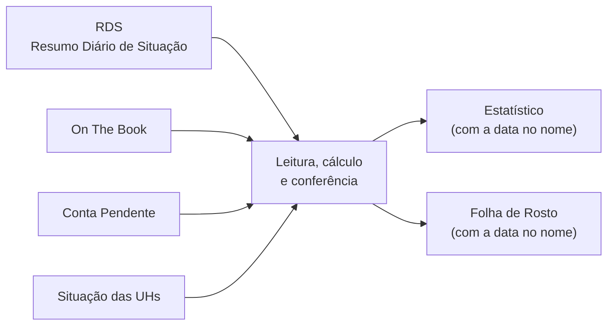

# Estatístico e Folha de Rosto

> Automação do relatório estatístico diário da auditoria noturna.
> Código: [`estatistico/Preencher Estatistico.bat`](../estatistico/Preencher%20Estatistico.bat)

## O problema

Todo dia a auditoria preenche dois arquivos que resumem a operação do hotel:

- **Estatístico** — abas *Estatístico*, *Lanç. Estatístico* e *Análise detalhada*
- **Folha de Rosto do Resumo Estatístico** — o resumo de uma página que a gerência lê

Os números vêm de **quatro relatórios** do sistema. No processo manual, era abrir um relatório de cada vez, procurar cada informação, digitar na linha certa, ir e voltar entre os relatórios — e no fim conferir se nenhum número foi parar no lugar errado e se os valores batiam.

**Tempo:** 30 a 40 minutos por noite → **menos de 2 minutos**.

## O que a automação faz

1. **Acha os arquivos na pasta** pelo nome (se tiver mais de um parecido, usa o mais recente e avisa)
2. **Lê os quatro relatórios** (`.xls` ou `.xlsx`)
3. **Preenche** o Estatístico e a Folha de Rosto
4. **Confere** se a soma das receitas lançadas bate com o *Total dos Débitos* do RDS
5. **Faz backup** dos arquivos anteriores e salva os novos **com a data da auditoria no nome**
6. **Mostra um relatório na tela** com tudo que foi lançado e o que precisa de atenção

O que continua manual: *UH's em manutenção* (o único número que nenhum relatório traz — o script repete o do dia anterior e avisa) e os comparativos com outros hotéis, que chegam por mensagem.

## Glossário rápido

| Termo | Significado |
|---|---|
| **UH** | Unidade Habitacional — o quarto |
| **Pool** | Conjunto de UHs que o hotel opera |
| **RDS** | Resumo Diário de Situação — fechamento do dia |
| **On The Book** | Reservas já confirmadas pros próximos dias |
| **Conta Pendente** | Contas em aberto (saldo e créditos) |
| **Situação das UHs** | "Foto" de agora de cada quarto: ocupado, vago, limpo, sujo… |
| **Walk-in** | Hóspede que chega sem reserva |
| **No show** | Reserva que não apareceu |
| **Day use** | Uso do quarto só durante o dia |
| **Layover** | Tripulação de companhia aérea em escala |
| **Diária média** | Receita de hospedagem ÷ UHs ocupadas |
| **RevPAR** | Receita de hospedagem ÷ UHs do pool |

## De onde vem cada número

### Lanç. Estatístico (o dia N fica na coluna N+1)

| Bloco | Campo | Origem |
|---|---|---|
| Estatísticas | UH's no pool, bloqueadas, uso da casa, ocupadas | RDS |
| | Cortesia + permuta | RDS (soma das duas) |
| | Adultos e crianças | RDS — vêm juntos numa célula (`52/3/1`) e são separados |
| | Mensalistas e walk-ins | Situação das UHs |
| | UH's em manutenção | Repete o dia anterior (não existe em relatório) |
| Receitas | Cada item do RDS na sua linha | RDS, por uma tabela item → linha |
| | Estornos | Separados entre hospedagem e outras receitas |
| Previsão 3 dias | Pool | RDS |
| | Ocupadas, diária média, adultos | On The Book |
| Contas pendentes | Quantidade, débito (saldo total), crédito (créditos gerais) | Conta Pendente |

### Estatístico

Só a célula do **dia** muda. O resto da aba é fórmula e se atualiza sozinho.

### Análise detalhada (o dia N fica na linha N+4)

| Campo | Origem |
|---|---|
| Day use | RDS → *Hóspedes Day Use* |
| No show | RDS → número da esquerda de *No Show / No Show Cobrados* |
| Check-ins / Check-outs realizados | RDS → *Quantidade de Entradas* / *Saídas* |
| Permanência estendida, Saída antecipada, Ocupados grupos | Sempre 0 |

### Folha de Rosto

**Hoje e acumulado do mês** — calculados a partir do Lanç. Estatístico:

| Indicador | Cálculo |
|---|---|
| Ocupação | ocupadas ÷ pool |
| Diária média | receita de hospedagem ÷ ocupadas |
| RevPAR | receita de hospedagem ÷ pool |
| Receita hospedagem | soma das linhas de hospedagem |
| On the Book | receita de hospedagem acumulada + receita futura do On The Book |
| Previsão 3 dias | % de ocupação dos próximos 3 dias no On The Book |

**Bloco da direita — a foto de agora.** Vem da *Situação das UHs*, que é o relatório mais atual: ocupadas, walk-in, bloqueadas, vago limpo, vago sujo e layover. No show e uso da casa + cortesia vêm do RDS. *Check-in após 00h* fica em branco: é preenchido na passagem de plantão.

**Bloco central — o fechamento.** Vem do RDS:

| Campo | Cálculo |
|---|---|
| Número de hóspedes | adultos + crianças |
| Hóspedes / UH's ocupadas | **só adultos** ÷ ocupadas (mesmo critério do índice de frequência do RDS) |
| UH's ocupadas, No show, Aptos bloqueados | RDS |
| Check-in / Check-out previstos | Entradas e saídas do dia seguinte no On The Book |

## Regras da Situação das UHs

O relatório traz todos os quartos do prédio, inclusive unidades de condomínio que não fazem parte do hotel.

| Regra | Critério |
|---|---|
| Pool do hotel | Tudo que **não** é do tipo `COND` |
| Cada UH conta uma vez | Mesmo com mais de um hóspede |
| Vago limpo | `VAGO` + governança `LIMPO`, `INSPECAO` ou `ARRUMACAO` |
| Vago sujo | `VAGO` + `SUJO` |
| Walk-in | "WALK IN" na empresa ou observação **e** chegada na data da auditoria |
| Layover | "LAY OVER" / "LAYOVER" na empresa ou observação **e** chegada na data da auditoria |
| Mensalista | Campo *Tipo Hósp.* |

## Conferências e avisos

O script não só preenche — ele desconfia do que leu:

- **Receitas × Total dos Débitos do RDS** — mostra `BATEU CERTINHO` ou o valor da diferença
- **Pool da Situação das UHs × pool do RDS** — avisa se forem diferentes
- **Item de receita novo no RDS** — lista o item que não tem linha na planilha
- **Status de governança desconhecido** — avisa em vez de chutar se é limpo ou sujo
- **Dia já lançado** — avisa que sobrescreveu (o estado anterior fica no backup)
- **Arquivos duplicados na pasta** — mostra qual usou

## Detalhes técnicos

- **Busca por rótulo, não por posição.** Cada relatório vira uma grade `{(linha, coluna): valor}` e os campos são encontrados pelo texto do rótulo (normalizado, sem acento). Se o sistema mudar uma linha de lugar, o script continua achando.
- **Um arquivo só.** O `.bat` é ao mesmo tempo um script do Windows e um programa Python válido: o cabeçalho roda no `cmd` e chama o Python no próprio arquivo, e pro Python esse cabeçalho é só um texto. Resultado: a equipe dá dois cliques em um único arquivo.
- **Backup antes de gravar.** Os dois arquivos vão pra `backup/` com data e hora; o arquivo do dia anterior sai da pasta pra não confundir.

## Como usar

1. Exporte do sistema **RDS**, **On The Book**, **Conta Pendente** e **Situação das UHs**
2. Salve na pasta da auditoria, junto com o Estatístico e a Folha de Rosto do dia anterior
3. Dê dois cliques em `Preencher Estatistico.bat`
4. Leia os avisos da tela, digite as UH's em manutenção e os comparativos

Os nomes que identificam as planilhas na pasta ficam em `NOME_ESTATISTICO` e `NOME_FOLHA_ROSTO`, no topo do script.

Pra testar sem dados reais, veja [`exemplos/`](../exemplos/).
